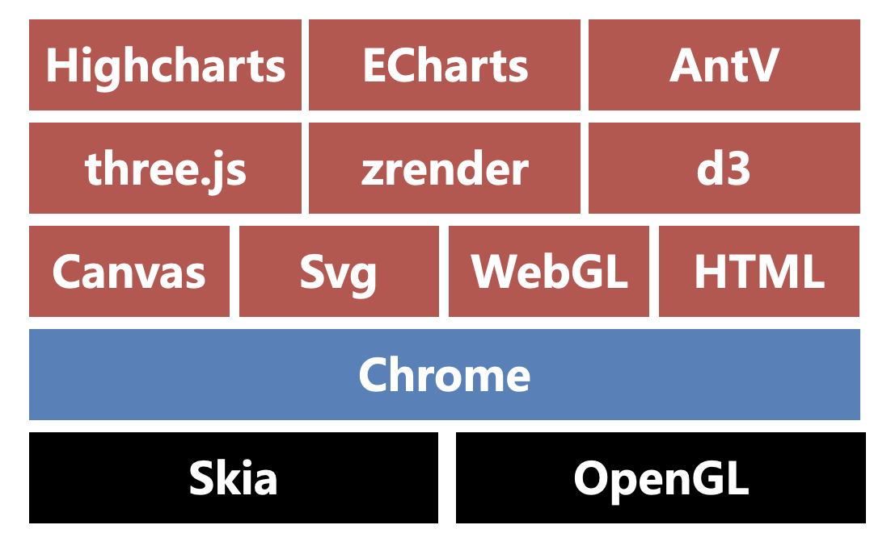
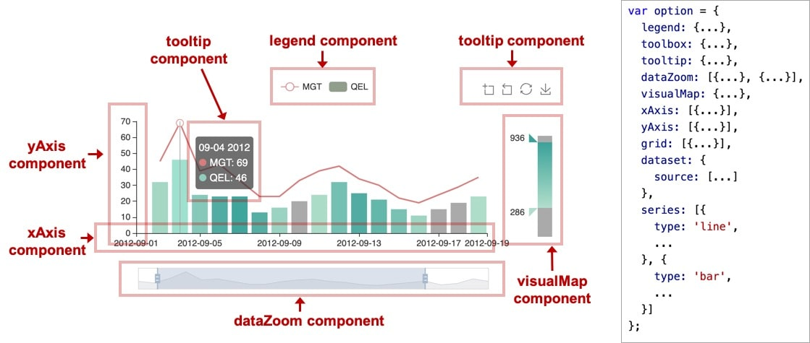

<!--
 * @Author      : 吴晓斌
 * @CreateData  : 2020-06-06 20:25:37
 * @LastEditTime: 2020-07-14 17:34:22
 * @Description : 数据可视化-笔记
-->

# 笔记

### 技术分类

1. 底层引擎：Skia、OpenGL
2. 浏览器：Chrome
3. 底层：Canvas、Svg、WebGL、HTML
4. 中层：Three.js、Zrender、D3.js
5. 上层：Highcharts、Echarts、AntV

### 重点掌握

- Canvas：HTML5 的新特性，它允许我们使用 canvas 元素在网页上通过 JavaScript 绘制图像。即画布，无法操作内部 dom，适用于有频繁动画的场景

- Svg：基于 XML 的图像文件格式，它的英文全称为 Scalable Vector Graphics，意思为可缩放的矢量图形。可操作具体的 dom，适合做字体图标，也能节省内存

- Zrender：二维绘图引擎，它提供 Canvas、SVG、VML 等多种渲染方式。ZRender 也是 ECharts 的渲染器

- Echarts：**首选方案**

- AntV：**备选方案**

### 适当了解

- WebGL：一种 3D 绘图协议，WebGL 可以为 HTML5 Canvas 提供硬件 3D 加速渲染，这样 Web 开发人员就可以借助系统显卡来在浏览器里更流畅地展示 3D 场景和模型了，还能创建复杂的导航和数据视觉化

- Three.js：基于 WebGL 的 3D 图形库

- D3.js：数据驱动的矢量图库，基于 Canvas、Svg 和 HTML

### 图示

### 概念

- 多系列：一个坐标系中，有多个图（饼图、折线图、柱状图等）

- ECharts 4.0 新特性之 dataset：用于单独的数据集声明，从而数据可以单独管理，被多个组件复用，并且可以自由指定数据到视觉的映射。这一特性能将逻辑和数据分离，带来更好的复用，如下图：

  

- 组件，如下图：

  

- 定位：类似 CSS 绝对定位的属性来控制组件的位置，如下图：

  
